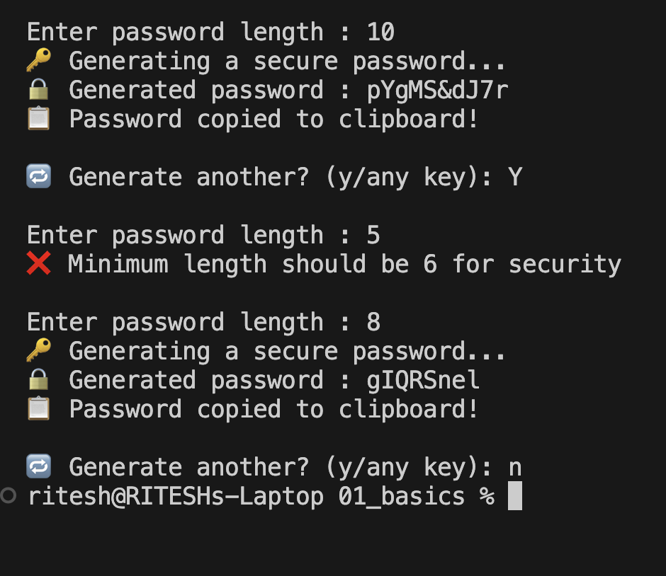

# 🔐 Password Generator GUI

[](https://www.python.org/)
[](#)
[](#)

A simple and user-friendly **Password Generator GUI App** built using **Python Tkinter**. This tool generates strong passwords instantly, allows copy-to-clipboard, and gives real-time feedback on password strength — all in a lightweight interface.

---

## 🖼️ Screenshot

<p align="center">
  
</p>

---

## ✨ Features

- ✅ Generate strong passwords of any length
- 🔠 Includes uppercase, lowercase, numbers & symbols
- 📋 One-click copy to clipboard
- 🎯 Password strength meter
- 🔁 Regenerate instantly with a button click
- 🧑‍💻 Clean and minimal UI using Tkinter

---

## ⚙️ How to Run

### 1. Clone this repository

```bash
git clone https://github.com/rahool-oo7/password-generator-gui.git
cd password-generator-gui
```

### 2. Install dependencies
Only built-in Python libraries are used. But ensure:

Python 3.x installed

Optional (for clipboard support): pyperclip

```bash
pip install pyperclip
```

### 3. Run the app
```bash
python password_generator_gui.py
```

## 🧠 How It Works
Uses Python's random module to generate characters from a defined set.

Uses Tkinter to build the interface.

Displays live password strength based on length and complexity.

Copies to clipboard using pyperclip or native clipboard_append() method.

## 🛡️ Character Set Used
```bash
python

abcdefghijklmnopqrstuvwxyz
ABCDEFGHIJKLMNOPQRSTUVWXYZ
0123456789
@ # $ % & * ! ?
```

## 💡 Future Enhancements
Dark mode UI

Option to exclude similar-looking characters (l, I, 1, O, 0)

Save history/log of generated passwords

Export to .exe using pyinstaller for Windows

## 📁 Project Structure
```
.
├── password_generator_gui.py
├── README.md
└── screenshots/
    └── app_gui.png
```

### Made with ❤️ by Ritesh Kumar

## 🌐 Connect
📧 Email: riteshwork.work@gmail.com

🌐 Portfolio: yourportfolio.com
